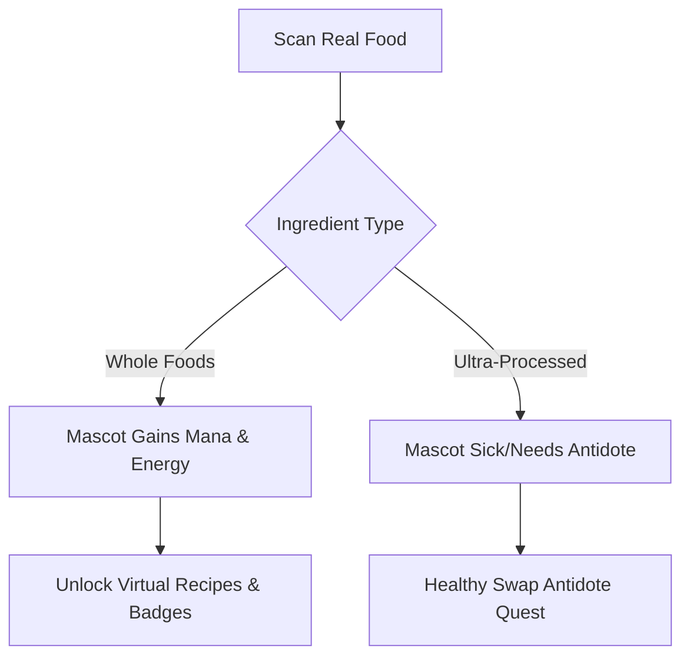

# Conceptual Pivot Proposals: Making Our Food Scanner Stand Out

To stand out in a crowded market of generic NOVA and Yuka-like food scanners, we must shift from a passive **"checking tool"** to an active, engaging **"lifestyle companion"** or **"gamified experience."**

Below are four distinct, premium conceptual directions to differentiate our product, followed by a competitive comparison map.

---

## 🎨 Direction 1: "The Food Alchemist" (Gamified RPG & Mascot Sandbox)
*Shift the utility of scanning from "checking if a food is bad" to "collecting ingredients to nurture a virtual ecosystem."*



### 🌟 The Core Twist
Instead of a dry health log, your scanning app is a companion game. Your Mascot (the Orb) is a digital creature whose health, appearance, and environment directly reflect the food you scan.
- **Whole Foods (NOVA 1)** are treated as **"Pure Elements"** (Mana, Crystal, Herb) that level up your Mascot and unlock cosmic items for their space.
- **Ultra-Processed Foods (NOVA 4)** are treated as **"Tainted Formulations."** Scanning them causes the mascot to catch "diet fatigue." To cure them, you must complete a **"Purification Quest"** by scanning a whole-food swap.

### 🏆 Why it Differentiates
- **Emotional Loop:** Users scan foods because they care about their mascot's state, driving high daily retention.
- **Positive Reinforcement:** Focuses on collecting "pure elements" rather than just showing red warning labels.

---

## 🕵️‍♂️ Direction 2: "Stealth Food Detective" (Interactive Noir Investigation)
*Transform the app into an interactive investigation board, exposing the clever marketing tricks food corporations use.*

### 🌟 The Core Twist
You are a detective investigating the "crimes" of the food industry. The UI is designed like a retro investigator's case folder (corkboard background, polaroids, stamp marks, red string connections).
- **The Crime:** Disguising synthetic additives and sugars behind 60+ chemical synonyms.
- **The Gameplay:** When you scan a product, the app "interrogates" the label. It highlights sneaky terms (e.g., *“yeast extract”* as stealth MSG, or *“chicory root fiber”* to artificially boost fiber claims).
- **The Case Files:** Users build a collection of "convicted products" on their dashboard.

### 🏆 Why it Differentiates
- **Intrigue & Education:** Framed as a mystery rather than homework. Users feel empowered by learning how they are being tricked.
- **Unique Aesthetic:** Replaces the clean, sterile green/red dashboards of Yuka/NOVA checkers with a high-texture noir aesthetic.

---

## 🔄 Direction 3: "The 30-Day UPF Detox Coach" (Actionable Rehabilitation)
*Move away from "judgment" and focus on a structured, step-by-step reduction program.*

```
   [ Day 1: Beverage Audit ] ➔ [ Day 10: Emulsifier Cut ] ➔ [ Day 20: Sweetener Swap ]
```

### 🌟 The Core Twist
Most apps tell you "don't eat this" but give you no roadmap. This app is a structured **detox program** designed to guide users off ultra-processed dependency.
- **UPF Intake Tracker:** Instead of logging calories, you log the *ratio* of processed vs. unprocessed foods you eat. The app calculates your daily **"UPF Dependency Score"**.
- **Guided Milestones:** The app guides you through 30 levels (e.g., Level 1: Audit your morning coffee; Level 5: Audit emulsifiers in bread; Level 12: Swap synthetic dyes).
- **Progressive unlocked advice:** Users scan to check if a product fits their *current* level of detox capability.

### 🏆 Why it Differentiates
- **Clear Goal-Oriented Value:** People pay for programs (coaching) much more willingly than they pay for simple scanning tools.
- **Non-Restrictive:** Promotes gradual improvement rather than cold-turkey restriction.

---

## 🦠 Direction 4: "The Gut Shield" (Microbiome Integrity Focus)
*Specialize in the single most discussed modern health topic: Gut health and the intestinal lining.*

### 🌟 The Core Twist
Existing scanners focus on weight loss, sugar, or general processing. This app focuses strictly on **gut lining disruptors**.
- **Microbiome Audit:** The scanner flags ingredients specifically proven to erode the mucosal gut lining or cause gut inflammation (e.g., emulsifiers like Carboxymethylcellulose, Polysorbates, Carrageenan, and artificial sweeteners).
- **Gut Integrity Score:** Products get a score based on how safe they are for your gut flora.
- **Leaky Gut Risk warning:** Shows scientific, clear warnings explaining *why* a specific thickener is harmful, linked to digestive health.

### 🏆 Why it Differentiates
- **Niche Dominance:** Owns the rapidly growing "gut health / gut biome" market.
- **High Scientific Trust:** Translates clinical microbiology studies into simple, actionable ratings for everyday groceries.

---

## 📊 Competitor Comparison Map

| App | Primary Focus | UI Theme | Monetization | Weakness We Can Exploit |
| :--- | :--- | :--- | :--- | :--- |
| **Yuka** | General Score (0-100) based on calories/organic/additives | Simple Clean White | Premium features (search, offline) | **Boring & Preachy:** Feels like homework; no gamification or active tracking. |
| **Trash Panda** | Flagging "bad" ingredients | Cute, playful green | Scanner limits / Premium list builder | **Passive Checker:** Tells you what's bad but offers no structured plan or program to improve. |
| **Bobby Approved** | Red light / Green light based on clean ingredients | Clean corporate white | Direct brand sponsorships | **Ultra-restrictive:** Polarizing and lacks personalization (one-size-fits-all criteria). |
| **BiteFix (Ours - Proposed)** | *Depends on chosen direction* (e.g. Alchemist/Detox) | Curated dark mode / Dynamic Mascot | Program subscription / Pet progression | **Engaging & Goal-Oriented:** Gamifies healthy eating or guides a detox journey. |
